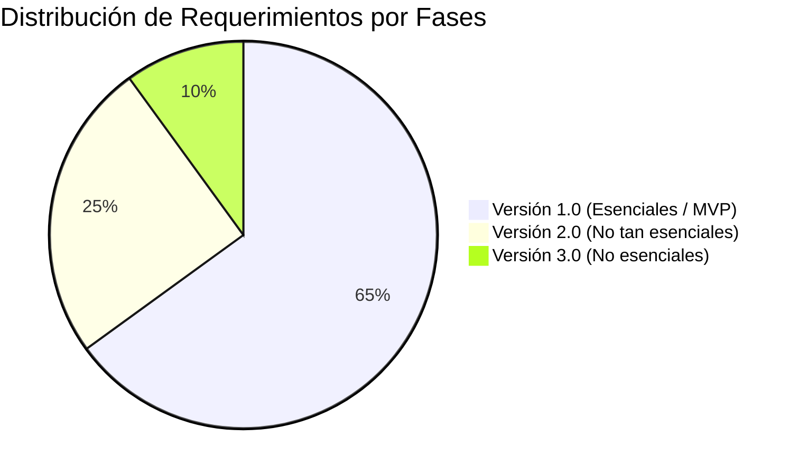
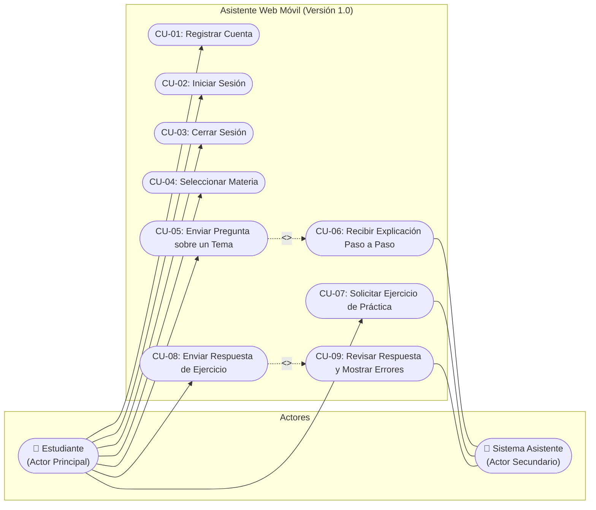

# INFORME DE LEVANTAMIENTO DE INFORMACIÓN, ESPECIFICACIÓN DE REQUERIMIENTOS Y CASOS DE USO
## Proyecto: Asistente Web Móvil de Tutoría Académica Escolar ("EduAsistente")

---

### FICHA TÉCNICA DEL PROYECTO
- **Nombre del Sistema:** Asistente Web de Tutoría Académica Escolar (EduAsistente).
- **Destinatarios Finales:** Estudiantes de nivel secundaria (con dificultades en Ciencias Exactas y Lenguaje).
- **Cliente:** Madre de familia (desconoce de tecnología, no cuenta con apoyo externo, busca que sus hijos aprendan por sí mismos).
- **Dispositivo Objetivo Exclusivo:** Teléfonos celulares inteligentes (Smartphones) mediante navegador web móvil.
- **Versión del Documento:** 1.1 (Corregida y Depurada).
- **Estado:** Aprobado para Diseño y Desarrollo de Versión 1 (MVP).

---

## 1. INTRODUCCIÓN Y CONTEXTO DEL PROBLEMA

### 1.1 Antecedentes
En el ámbito educativo escolar de nivel secundaria, las materias de razonamiento lógico y científico (Matemáticas, Física, Química) y comunicación (Lenguaje) presentan una alta tasa de dificultad para los estudiantes. En este caso particular, los hijos de la clienta cursan la secundaria y experimentan un rezago progresivo desde el inicio de este ciclo educativo.

### 1.2 Definición de la Problemática Central
A partir de las entrevistas con la clienta, se identifican las siguientes causas y efectos que configuran el problema raíz:
1. **Barrera Pedagógica:** La metodología y el ritmo de explicación de los docentes en el colegio no cubren los tiempos individuales de aprendizaje de los estudiantes.
2. **Ausencia de Apoyo en el Hogar:** En casa no cuentan con profesor particular ni apoyo académico; la madre está sola en este proceso, desconoce el contenido escolar y no tiene conocimientos de tecnología para asistirlos.
3. **Brecha de Dispositivos:** El núcleo familiar **no dispone de computadora de escritorio ni laptop**; el único medio de acceso digital disponible son **teléfonos celulares**.
4. **Desorientación en Hábitos de Estudio:** Los estudiantes estudian de manera autodidacta durante 2 horas aproximadamente leyendo libros o adelantando temas por iniciativa propia, pero cuando no entienden un concepto no tienen a quién recurrir ("se quedan sin hacer nada"). Se observa que prueban diversos métodos sin consolidar uno efectivo.

### 1.3 Restricciones Críticas del Entorno
> [!IMPORTANT]
> **Condiciones no negociables para el software:**
> - **Entorno 100% Móvil:** La interfaz debe estar diseñada para celulares. No debe requerir computadora, teclado físico ni mouse.
> - **Facilidad Extrema de Uso:** El sistema debe ser directo y comprensible para personas sin conocimientos de tecnología.
> - **Disponibilidad Permanente (24/7):** El sistema debe estar disponible en cualquier momento, sin restricción de horario, para resolver dudas en cuanto surjan.

---

## 2. PROCESO DE LEVANTAMIENTO DE INFORMACIÓN

El levantamiento de requisitos se ejecutó mediante entrevistas estructuradas orientadas a dos dimensiones: el diagnóstico del problema real (situación actual) y la definición de la solución deseada (situación esperada).

### 2.1 Fase I: Diagnóstico de la Problemática Actual

| N° | Pregunta de Diagnóstico | Respuesta Obtenida | Hallazgo / Implicación Técnica |
|:---|:---|:---|:---|
| 1 | ¿Qué es lo que más le preocupa del rendimiento académico de sus hijos? | *"Que no aprendan."* | El objetivo de valor no es solo sacar una nota aprobatoria, sino asegurar el aprendizaje conceptual y la autonomía. |
| 2 | ¿En qué materias tienen más dificultades? | *Matemáticas, Lenguaje y Química* (sumado a *Física*). | El sistema debe cubrir estas cuatro materias de secundaria. |
| 3 | ¿Desde cuándo nota estas dificultades? | *"Desde que entraron a secundaria."* | El nivel de dificultad requerido corresponde a educación secundaria. |
| 4 | ¿Qué cree que les impide comprender los temas? | *"La explicación de los docentes."* | Se requiere una pedagogía alternativa: explicaciones paso a paso, con lenguaje claro y paciente. |
| 5 | ¿Actualmente reciben ayuda para estudiar? ¿De quién? | *"No."* | El sistema actuará como asistente directo en el hogar. |
| 6 | ¿Cómo estudian normalmente en casa? | *"Leyendo libros o los temas adelantados."* | Hay proactividad en los alumnos; el software debe complementar la lectura con práctica y retroalimentación. |
| 7 | ¿Utilizan algún recurso digital para estudiar? | *"Celular."* | El smartphone es el canal de entrega obligatorio. |
| 8 | ¿Qué hacen cuando no entienden un tema? | *"Nada."* | Punto crítico de bloqueo: el estudiante se detiene por falta de ayuda inmediata. |
| 9 | ¿Cuánto tiempo dedican a estudiar fuera del colegio? | *Aproximadamente 2 horas diarias.* | Las sesiones del asistente deben ser dinámicas y ágiles para optimizar esas 2 horas. |
| 10 | ¿Considera que los métodos actuales les funcionan? | *"Más o menos."* | La estrategia actual no les está dando resultados satisfactorios. |
| 11 | ¿Conoce cuáles son los métodos de estudio de sus hijos? | *"No, los desconoce, parece que están probando distintos métodos."* | Oportunidad para que el sistema introduzca técnicas efectivas (por ejemplo, aprender por asociación con temas de su interés). |

---

### 2.2 Fase II: Definición y Especificación del Sistema

| N° | Pregunta de Definición | Respuesta Obtenida | Traducción a Capacidad del Sistema |
|:---|:---|:---|:---|
| 1 | ¿Qué espera que haga exactamente el asistente? | *"Que pueda sacarle las dudas que tenga."* | Asistente de preguntas y respuestas en lenguaje natural. |
| 2 | ¿Le gustaría que explique los temas paso a paso? | *"Sí."* | Explicaciones didácticas estructuradas paso a paso. |
| 3 | ¿Le gustaría que pueda responder preguntas de los estudiantes? | *"Sí."* | Entrada de texto para que el estudiante formule preguntas sobre los temas. |
| 4 | ¿Le gustaría que genere ejercicios para practicar? | *"Sí."* | Generación de ejercicios prácticos acordes al tema consultado. |
| 5 | ¿Le gustaría que evalúe sus respuestas y les indique sus errores? | *"Sí."* | Revisión de respuestas, indicación del error cometido y muestra de la respuesta correcta. |
| 6 | ¿Le gustaría que adapte las explicaciones al nivel de cada hijo? | *"Sí."* | Adaptación de explicaciones y ejercicios al nivel (Fase posterior). |
| 7 | ¿Le gustaría que se adapte a la técnica de estudio de cada estudiante? | *"Sí, por ejemplo aprender por asociación con temas de su interés."* | Adaptación por asociación de temas de interés (Fase posterior). |
| 8 | ¿Le gustaría que pueda ayudar con varias materias? | *"Sí."* | Cobertura de Matemáticas, Física, Química y Lenguaje. |
| 9 | ¿Necesita que el sistema esté disponible en cualquier momento? | *"Sí."* | Disponibilidad en cualquier momento sin restricción de horario (24/7). |
| 10 | ¿Qué problema específico espera solucionar con este asistente? | *"Que pueda aprender a solucionar solo con las explicaciones del asistente."* | Que los hijos aprendan a resolver los problemas por sí mismos. |

---

## 3. ESPECIFICACIÓN DE REQUERIMIENTOS DEL SISTEMA

### 3.1 Requerimientos Funcionales (RF)

| Código | Requerimiento Funcional | Prioridad |
|:---|:---|:---:|
| **RF-01** | El sistema permitirá al usuario crear una cuenta y registrarse. | **Esencial (v1.0)** |
| **RF-02** | El sistema permitirá al estudiante iniciar sesión. | **Esencial (v1.0)** |
| **RF-03** | El sistema permitirá al estudiante cerrar sesión. | **Esencial (v1.0)** |
| **RF-04** | El sistema permitirá al estudiante elegir la materia que desea consultar (Matemáticas, Física, Lenguaje y Química). | **Esencial (v1.0)** |
| **RF-05** | El sistema permitirá al estudiante enviar preguntas sobre un tema. | **Esencial (v1.0)** |
| **RF-06** | El sistema responderá las preguntas del estudiante con explicaciones aclaratorias. | **Esencial (v1.0)** |
| **RF-07** | El sistema explicará los temas paso a paso. | **Esencial (v1.0)** |
| **RF-08** | El sistema generará ejercicios de práctica sobre los temas estudiados. | **Esencial (v1.0)** |
| **RF-09** | El sistema revisará las respuestas enviadas por el estudiante. | **Esencial (v1.0)** |
| **RF-10** | El sistema señalará los errores del estudiante y mostrará la respuesta correcta. | **Esencial (v1.0)** |
| **RF-11** | El sistema adaptará las explicaciones y ejercicios al nivel de cada estudiante. | No tan esencial (v2.0) |
| **RF-12** | El sistema adaptará las explicaciones según la técnica de estudio de cada estudiante (por ejemplo aprender por asociación con temas de su interés). | No tan esencial (v2.0) |
| **RF-13** | El sistema guardará el progreso de cada estudiante. | No tan esencial (v2.0) |

---

### 3.2 Requerimientos No Funcionales (RNF)

| Código | Requerimiento No Funcional | Prioridad |
|:---|:---|:---:|
| **RNF-01** | **Funcionamiento en celular:** El sistema funcionará correctamente desde un celular mediante el navegador. | **Esencial (v1.0)** |
| **RNF-02** | **Facilidad de uso:** El sistema deberá ser fácil de usar para personas sin conocimientos de tecnología. | **Esencial (v1.0)** |
| **RNF-03** | **Disponibilidad permanente:** El sistema estará disponible en cualquier momento, sin restricción de horario. | **Esencial (v1.0)** |
| **RNF-04** | **Rapidez de respuesta:** El sistema deberá responder rápidamente a las consultas del estudiante. | No tan esencial (v2.0) |
| **RNF-05** | **Protección de la información:** El sistema protegerá la información de los usuarios. | No tan esencial (v2.0) |
| **RNF-06** | **Soporte multiusuario:** El sistema soportará múltiples usuarios al mismo tiempo. | No esencial (v3.0) |

---

## 4. PRIORIZACIÓN Y ALCANCE: MATRIZ DE ENTREGABLES

### 4.1 Alcance de la Primera Versión (MVP v1.0 - Núcleo Esencial)
> [!NOTE]
> **Justificación del MVP:** Concentrarse en que el estudiante pueda sacarse las dudas y aprender desde su celular hoy mismo, sin depender de un adulto ni de soporte técnico.
- Registro de cuenta (RF-01).
- Iniciar sesión (RF-02) y cerrar sesión (RF-03).
- Selección de materia: Matemáticas, Física, Lenguaje y Química (RF-04).
- Enviar preguntas sobre un tema (RF-05).
- Respuestas aclaratorias y explicaciones paso a paso (RF-06, RF-07).
- Generación de ejercicios de práctica (RF-08).
- Revisión de respuestas con indicación de errores y respuesta correcta (RF-09, RF-10).
- Funcionamiento asegurado en celular (RNF-01), interfaz sumamente sencilla (RNF-02) y disponibilidad permanente (RNF-03).

### 4.2 Alcance de Versiones Posteriores (Backlog)
- **Versión 2.0:** Adaptar explicaciones y ejercicios al nivel de cada estudiante (RF-11), adaptar a la técnica de estudio por asociación con temas de su interés (RF-12), guardar el progreso (RF-13), optimizar la rapidez de respuesta (RNF-04) y proteger la información de los usuarios (RNF-05).
- **Versión 3.0:** Soporte para múltiples usuarios al mismo tiempo (RNF-06).

---

## 5. MODELADO DE CASOS DE USO (UML) - PRIMERA VERSIÓN

### 5.1 Actores del Software
1. **Estudiante (Actor Principal):** Hijo/a de secundaria que interactúa directamente desde el celular para seleccionar la materia, enviar sus preguntas, revisar las explicaciones y resolver ejercicios.
2. **Sistema Asistente (Actor Secundario / Soporte):** Módulo inteligente que procesa las dudas pedagógicamente, elabora las explicaciones paso a paso, genera los ejercicios de práctica y revisa las respuestas señalando errores y la solución correcta.

---

### 5.2 Diagrama General de Casos de Uso (Versión 1.0)

---

### 5.3 Especificación Detallada de Casos de Uso (Formato Estándar IEEE)

#### **CU-01: Registrar Cuenta de Usuario**
- **Identificador:** CU-01
- **Nombre:** Registrar Cuenta de Usuario
- **Actor Principal:** Estudiante (o usuario)
- **Objetivo:** Permitir la creación de una cuenta básica para poder acceder al asistente desde el celular.
- **Precondiciones:** Disponer de conexión a internet y acceder a la dirección web del sistema desde el celular.
- **Flujo Principal (Básico):**
  1. El usuario ingresa a la página principal y pulsa el botón "Crear Cuenta".
  2. El sistema despliega un formulario sencillo (Nombre, Usuario/Correo y Contraseña).
  3. El usuario ingresa sus datos y presiona "Registrarse".
  4. El sistema valida que los campos no estén vacíos y cumplan con el formato básico.
  5. El sistema registra la cuenta en la base de datos.
  6. El sistema confirma el registro e inicia sesión automáticamente, dirigiendo al estudiante a la pantalla de materias.
- **Flujos Alternativos:**
  - *4a. Datos incompletos:* El sistema muestra un mensaje claro ("Por favor, completa todos los campos"). El flujo vuelve al paso 3.
  - *4b. Cuenta existente:* El sistema muestra: "Este usuario ya está registrado. Por favor, inicia sesión".
- **Postcondiciones:** La cuenta queda registrada y el usuario autenticado.

---

#### **CU-02: Iniciar Sesión**
- **Identificador:** CU-02
- **Nombre:** Iniciar Sesión
- **Actor Principal:** Estudiante
- **Objetivo:** Validar la identidad del estudiante y darle acceso al asistente.
- **Precondiciones:** Tener una cuenta registrada previamente (CU-01).
- **Flujo Principal (Básico):**
  1. El estudiante abre la aplicación en su navegador móvil.
  2. Ingresa su usuario/correo y contraseña.
  3. Presiona el botón "Entrar".
  4. El sistema valida las credenciales ingresadas.
  5. El sistema autoriza el acceso y muestra la pantalla con las materias disponibles.
- **Flujos Alternativos:**
  - *4a. Credenciales incorrectas:* El sistema muestra un mensaje amigable: "Usuario o contraseña no coinciden. Intenta de nuevo".
- **Postcondiciones:** El estudiante mantiene su **sesión activa** en el navegador móvil para consultar libremente.

---

#### **CU-03: Cerrar Sesión**
- **Identificador:** CU-03
- **Nombre:** Cerrar Sesión
- **Actor Principal:** Estudiante
- **Objetivo:** Finalizar la sesión activa de forma segura.
- **Precondiciones:** El estudiante debe tener una sesión iniciada (CU-02).
- **Flujo Principal (Básico):**
  1. El estudiante toca el botón "Cerrar Sesión" en la barra superior.
  2. El sistema destruye los datos de la sesión activa en el navegador.
  3. El sistema redirige al estudiante a la pantalla de bienvenida/inicio de sesión.
- **Postcondiciones:** La sesión queda **completamente cerrada**; no se puede acceder a las funciones del asistente sin volver a identificarse.

---

#### **CU-04: Seleccionar Materia**
- **Identificador:** CU-04
- **Nombre:** Seleccionar Materia
- **Actor Principal:** Estudiante
- **Objetivo:** Elegir la asignatura escolar sobre la cual se desea consultar o practicar.
- **Precondiciones:** Estudiante con sesión activa (CU-02).
- **Flujo Principal (Básico):**
  1. El sistema presenta al estudiante una cuadrícula con botones grandes y claros:
     - 📐 **Matemáticas**
     - ⚡ **Física**
     - 🧪 **Química**
     - 📖 **Lenguaje**
  2. El estudiante toca la materia en la que tiene dudas.
  3. El sistema carga la pantalla del asistente con el contexto de la materia seleccionada.
- **Flujos Alternativos:**
  - *3a. Cambiar de materia:* El estudiante puede pulsar "Cambiar de Materia" en cualquier momento para volver al menú de selección.
- **Postcondiciones:** El área de trabajo queda configurada con la materia elegida.

---

#### **CU-05: Enviar Pregunta sobre un Tema**
- **Identificador:** CU-05
- **Nombre:** Enviar Pregunta sobre un Tema
- **Actor Principal:** Estudiante
- **Objetivo:** Enviar una duda o ejercicio escolar para recibir una respuesta aclaratoria.
- **Precondiciones:** Materia seleccionada (CU-04).
- **Flujo Principal (Básico):**
  1. El estudiante visualiza una caja de texto adaptada a la pantalla del celular ("Escribe aquí tu duda o ejercicio...").
  2. El estudiante redacta su duda o copia el enunciado de su tarea escolar.
  3. Presiona el botón "Preguntar".
  4. El sistema valida que el campo de texto no esté vacío.
  5. El sistema envía la consulta al generador de explicaciones (`<<include>>` CU-06).
- **Flujos Alternativos:**
  - *4a. Campo vacío:* El sistema avisa: "Por favor escribe tu duda antes de presionar Preguntar".
- **Postcondiciones:** La pregunta queda registrada y despachada para su explicación.

---

#### **CU-06: Recibir Explicación Paso a Paso**
- **Identificador:** CU-06
- **Nombre:** Recibir Explicación Paso a Paso
- **Actor Primario:** Estudiante
- **Actor de Soporte:** Sistema Asistente
- **Objetivo:** Mostrar al estudiante la respuesta desglosada paso a paso para que comprenda el tema y aprenda a resolver por sí mismo.
- **Precondiciones:** Pregunta enviada por el estudiante (CU-05).
- **Flujo Principal (Básico):**
  1. El Sistema Asistente procesa la consulta según la materia seleccionada.
  2. El sistema organiza la respuesta paso por paso de forma didáctica:
     - **Paso 1: ¿De qué se trata?** (Explicación del concepto en palabras sencillas).
     - **Paso 2: ¿Qué datos o reglas necesitamos?** (Fórmulas, propiedades o definiciones aplicables).
     - **Paso 3: Desarrollo paso a paso** (Procedimiento guiado y detallado).
     - **Paso 4: Conclusión o resultado final**.
  3. El sistema muestra la respuesta de manera ordenada y legible en la pantalla del celular.
  4. El sistema habilita la opción: "Practicar un ejercicio sobre este tema".
- **Postcondiciones:** El estudiante visualiza la explicación paso a paso y cuenta con la base para asimilar el tema.

---

#### **CU-07: Solicitar Ejercicio de Práctica**
- **Identificador:** CU-07
- **Nombre:** Solicitar Ejercicio de Práctica
- **Actor Primario:** Estudiante
- **Actor de Soporte:** Sistema Asistente
- **Objetivo:** Generar un ejercicio de práctica acorde al tema consultado para comprobar lo aprendido.
- **Precondiciones:** Haber recibido una explicación (CU-06) o solicitarlo dentro de la materia.
- **Flujo Principal (Básico):**
  1. El estudiante presiona el botón "Practicar este tema" o "Generar Ejercicio".
  2. El Sistema Asistente formula un ejercicio práctico acorde a la materia y tema estudiado.
  3. El sistema muestra el enunciado del problema en pantalla y dispone de un espacio para que el estudiante ingrese su respuesta.
- **Postcondiciones:** El ejercicio de práctica queda activo en pantalla a la espera de la solución del estudiante.

---

#### **CU-08: Enviar Respuesta de Ejercicio**
- **Identificador:** CU-08
- **Nombre:** Enviar Respuesta de Ejercicio
- **Actor Principal:** Estudiante
- **Objetivo:** Enviar la solución o resultado trabajado por el estudiante para su revisión.
- **Precondiciones:** Ejercicio activo en pantalla (CU-07).
- **Flujo Principal (Básico):**
  1. El estudiante resuelve el problema en su cuaderno y escribe su resultado o respuesta en el campo del celular.
  2. Presiona el botón "Revisar mi respuesta".
  3. El sistema comprueba que se haya ingresado texto en la respuesta.
  4. El sistema remite la respuesta al evaluador (`<<include>>` CU-09).
- **Postcondiciones:** La respuesta es recibida para su evaluación inmediata.

---

#### **CU-09: Revisar Respuesta y Mostrar Errores**
- **Identificador:** CU-09
- **Nombre:** Revisar Respuesta y Mostrar Errores
- **Actor Primario:** Estudiante
- **Actor de Soporte:** Sistema Asistente
- **Objetivo:** Revisar la respuesta del estudiante, señalar con claridad en qué se equivocó y mostrar la solución correcta paso a paso.
- **Precondiciones:** Respuesta enviada por el estudiante (CU-08).
- **Flujo Principal (Si la respuesta es correcta):**
  1. El Sistema Asistente valida que el resultado es correcto.
  2. Muestra un mensaje motivador y un breve resumen del procedimiento correcto.
  3. Ofrece la opción de realizar otro ejercicio similar o regresar al menú.
- **Flujo Secundario (Si la respuesta contiene errores):**
  1. El Sistema Asistente detecta el fallo en la respuesta enviada.
  2. Muestra la retroalimentación formativa:
     - **Dónde estuvo el error:** Indica con precisión qué parte del procedimiento o concepto falló (ej. *"Te equivocaste en el signo al despejar"* o *"Confundiste la fórmula"*).
     - **Respuesta correcta explicada:** Muestra el procedimiento correcto paso a paso para que el estudiante aprenda de su error.
  3. Ofrece la opción de intentar otro ejercicio similar.
- **Postcondiciones:** El estudiante comprende el error cometido y conoce la resolución correcta.

---

## 6. MATRIZ DE TRAZABILIDAD (REQUERIMIENTOS ESENCIALES vs CASOS DE USO v1.0)

| Requerimiento Funcional Esencial | Caso de Uso Asociado | Estado en v1.0 |
|:---|:---|:---:|
| **RF-01: Crear una cuenta y registrarse** | CU-01: Registrar Cuenta de Usuario | ✅ Incluido |
| **RF-02: Iniciar sesión** | CU-02: Iniciar Sesión | ✅ Incluido |
| **RF-03: Cerrar sesión** | CU-03: Cerrar Sesión | ✅ Incluido |
| **RF-04: Elegir la materia que desea consultar** | CU-04: Seleccionar Materia | ✅ Incluido |
| **RF-05: Enviar preguntas sobre un tema** | CU-05: Enviar Pregunta sobre un Tema | ✅ Incluido |
| **RF-06: Responder preguntas con explicaciones aclaratorias** | CU-06: Recibir Explicación Paso a Paso | ✅ Incluido |
| **RF-07: Explicar los temas paso a paso** | CU-06: Recibir Explicación Paso a Paso | ✅ Incluido |
| **RF-08: Generar ejercicios de práctica sobre los temas estudiados** | CU-07: Solicitar Ejercicio de Práctica | ✅ Incluido |
| **RF-09: Revisar las respuestas enviadas por el estudiante** | CU-08: Enviar Respuesta de Ejercicio | ✅ Incluido |
| **RF-10: Señalar los errores del estudiante y mostrar la respuesta correcta** | CU-09: Revisar Respuesta y Mostrar Errores | ✅ Incluido |

---

## 7. ESPECIFICACIONES TÉCNICAS BÁSICAS PARA LA VERSIÓN 1.0

Considerando la realidad de la familia (madre sin conocimientos de tecnología y uso exclusivo de celulares):
1. **Frontend Web Adaptativo (Mobile-First):**
   - Interfaz web minimalista con botones grandes, textos legibles y navegación fluida pensada para el pulgar en pantallas de teléfono.
2. **Backend Directo y Sencillo:**
   - Servicios web que reciban la consulta del estudiante y devuelvan las explicaciones organizadas en los 4 pasos didácticos.
3. **Flujo Pedagógico sin Complicaciones:**
   - Sin módulos de audio o voz (evitando fallos de red y sobrecostos).
   - Enfoque directo en texto claro, ejercicios sencillos y correcciones explicadas paso a paso.
