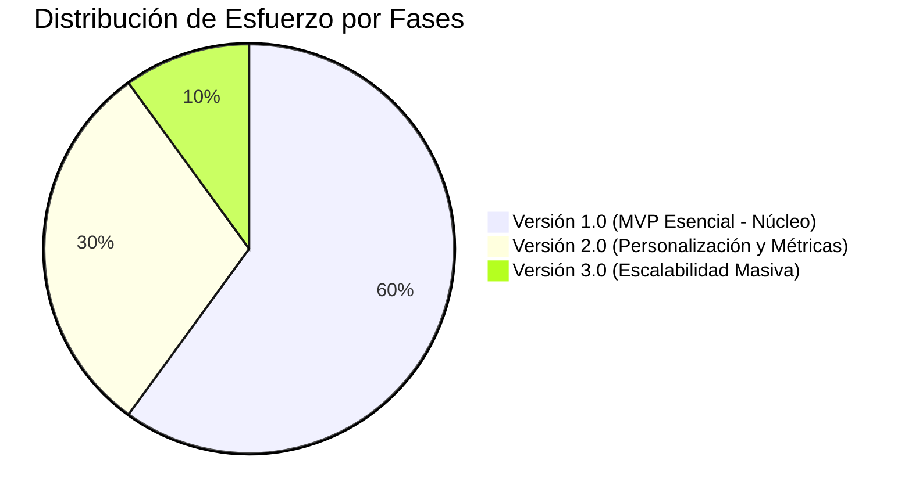
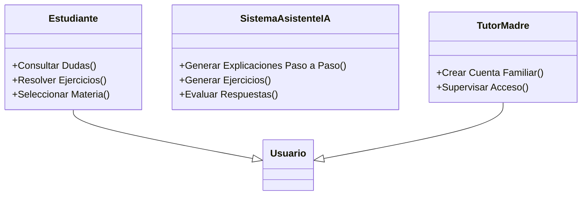
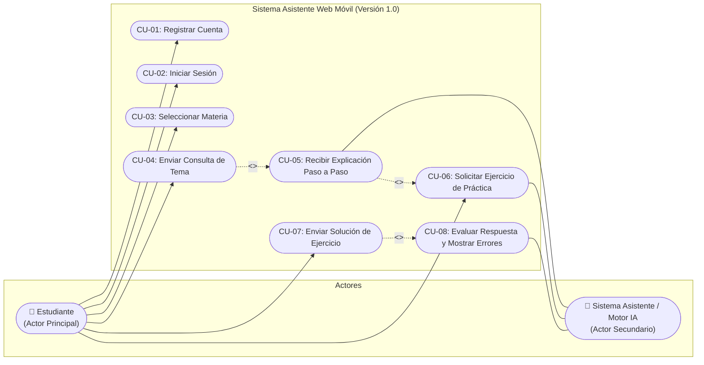

# INFORME DE LEVANTAMIENTO DE INFORMACIÓN, ESPECIFICACIÓN DE REQUERIMIENTOS Y CASOS DE USO
## Proyecto: Asistente Web Móvil de Tutoría Académica Escolar ("EduAsistente")

---

### FICHA TÉCNICA DEL PROYECTO
- **Nombre del Sistema:** Asistente Web de Tutoría Académica Escolar (EduAsistente).
- **Destinatarios Finales:** Estudiantes de nivel secundaria (con dificultades en Ciencias Exactas y Lenguaje).
- **Cliente / Promotor:** Madre de familia (representante legal / hogar sin soporte técnico especializado).
- **Dispositivo Objetivo Exclusivo:** Teléfonos celulares inteligentes (Smartphones) mediante navegador web móvil / PWA.
- **Versión del Documento:** 1.0 (Línea Base de Requerimientos y Casos de Uso para MVP).
- **Estado:** Aprobado para Diseño y Desarrollo de Versión 1.

---

## 1. INTRODUCCIÓN Y CONTEXTO DEL PROBLEMA

### 1.1 Antecedentes
En el ámbito educativo escolar de nivel secundaria, las materias de razonamiento lógico y científico (Matemáticas, Física, Química) y comunicación (Lenguaje) presentan una alta tasa de fricción cognitiva. En este caso particular, los hijos de la clienta cursan la secundaria y experimentan un rezago progresivo desde el inicio de este ciclo educativo.

### 1.2 Definición de la Problemática Central
A partir de las entrevistas con la clienta, se identifican las siguientes causas y efectos que configuran el problema raíz:
1. **Barrera Pedagógica:** La metodología y el ritmo de explicación de los docentes en el colegio no cubren los tiempos individuales de aprendizaje de los estudiantes.
2. **Ausencia de Tutoría en el Hogar:** En casa no cuentan con un profesor particular ni apoyo académico directo; la madre desconoce el contenido de secundaria y no tiene formación técnica para asistirlos.
3. **Brecha de Dispositivos (Device Gap):** El núcleo familiar **no dispone de computadora de escritorio ni laptop**; el único medio de acceso digital disponible son **teléfonos celulares**.
4. **Desorientación en Hábitos de Estudio:** Los estudiantes estudian de manera autodidacta durante 2 horas aproximadamente leyendo libros o adelantando temas por iniciativa propia, pero cuando no entienden un concepto no tienen a quién recurrir ("se quedan sin hacer nada"). Se observa que prueban diversos métodos sin consolidar uno efectivo.

### 1.3 Restricciones Críticas del Entorno
> [!IMPORTANT]
> **Condiciones de contorno no negociables para el software:**
> - **Entorno 100% Móvil:** La interfaz debe estar diseñada bajo el principio *Mobile-First*. No debe exigir teclado físico, ratón ni resoluciones de pantalla grandes.
> - **Cero Curva Tecnológica:** El sistema debe ser accesible y transparente, operable por adolescentes y comprensible para una madre con nulos conocimientos técnicos.
> - **Disponibilidad Permanente (24/7):** El aprendizaje y la resolución de dudas ocurren fuera de horario escolar y en momentos imprevistos de estudio en casa.

---

## 2. PROCESO DE LEVANTAMIENTO DE INFORMACIÓN

El levantamiento de requisitos se ejecutó mediante **entrevistas estructuradas** orientadas a dos dimensiones: el diagnóstico del problema real (situación actual) y la definición de la solución deseada (situación esperada).

### 2.1 Fase I: Diagnóstico de la Problemática Actual

| N° | Pregunta de Diagnóstico | Respuesta Obtenida | Hallazgo / Implicación Técnica |
|:---|:---|:---|:---|
| 1 | ¿Qué es lo que más le preocupa del rendimiento académico de sus hijos? | *"Que no aprendan."* | El objetivo de valor no es solo sacar una nota aprobatoria, sino asegurar el aprendizaje conceptual significativo y la autonomía. |
| 2 | ¿En qué materias tienen más dificultades? | *Matemáticas, Lenguaje y Química* (sumado a *Física*). | El sistema debe soportar un catálogo curricular multitemático, equilibrando fórmulas, teoría, gramática y ejercicios prácticos. |
| 3 | ¿Desde cuándo nota estas dificultades? | *"Desde que entraron a secundaria."* | El nivel de dificultad requerido corresponde a educación secundaria (12 a 17 años). |
| 4 | ¿Qué cree que les impide comprender los temas? | *"La explicación de los docentes."* | Se requiere una pedagogía alternativa: explicaciones secuenciales, desglosadas paso a paso, con lenguaje claro y paciente. |
| 5 | ¿Actualmente reciben ayuda para estudiar? ¿De quién? | *"No."* | El sistema asume el rol de tutor suplente en el hogar. |
| 6 | ¿Cómo estudian normalmente en casa? | *"Leyendo libros o los temas adelantados."* | Hay proactividad en los alumnos; el software debe complementar la lectura con interactividad y práctica. |
| 7 | ¿Utilizan algún recurso digital para estudiar? | *"Celular."* | El smartphone es el canal de entrega natural y obligatorio. |
| 8 | ¿Qué hacen cuando no entienden un tema? | *"Nada."* | Punto crítico de abandono: el estudiante se bloquea por falta de retroalimentación inmediata. |
| 9 | ¿Cuánto tiempo dedican a estudiar fuera del colegio? | *Aproximadamente 2 horas diarias.* | Las sesiones del asistente deben ser dinámicas, con tiempos de respuesta ágiles para optimizar esas 2 horas. |
| 10 | ¿Considera que los métodos actuales les funcionan? | *"Más o menos."* | La estrategia actual es ineficiente y genera frustración. |
| 11 | ¿Conoce cuáles son los métodos de estudio de sus hijos? | *"No, los desconoce, parece que están probando distintos métodos."* | Oportunidad para que el sistema introduzca técnicas efectivas (asociación, práctica guiada, resolución gradual). |

---

### 2.2 Fase II: Definición y Especificación del Sistema

| N° | Pregunta de Definición | Respuesta Obtenida | Traducción a Capacidad del Sistema |
|:---|:---|:---|:---|
| 1 | ¿Qué espera que haga exactamente el asistente? | *"Que pueda sacarle las dudas que tenga."* | Motor conversacional/asistente de preguntas y respuestas en lenguaje natural. |
| 2 | ¿Le gustaría que explique los temas paso a paso? | *"Sí."* | Algoritmo de estructuración pedagógica por pasos desglosados (Step-by-Step Breakdown). |
| 3 | ¿Le gustaría que pueda responder preguntas de los estudiantes? | *"Sí."* | Entrada abierta de preguntas textuales (o dudas puntuales) con respuestas contextualizadas. |
| 4 | ¿Le gustaría que genere ejercicios para practicar? | *"Sí."* | Generador dinámico de ejercicios adaptados a la materia y tema consultado. |
| 5 | ¿Le gustaría que evalúe sus respuestas y les indique sus errores? | *"Sí."* | Módulo de retroalimentación formativa: no solo califica (Correcto/Incorrecto), sino que explica el motivo del fallo. |
| 6 | ¿Le gustaría que adapte las explicaciones al nivel de cada hijo? | *"Sí."* | Nivelación de perfil por grado o comprensión (previsto para roadmap evolutivo). |
| 7 | ¿Le gustaría que se adapte a la técnica de estudio de cada estudiante? | *"Sí, por ejemplo aprender por asociación con temas de su interés."* | Parametrización pedagógica con analogías y ejemplos vinculados a la vida cotidiana o intereses. |
| 8 | ¿Le gustaría que pueda ayudar con varias materias? | *"Sí."* | Módulos independientes por asignatura: Matemáticas, Física, Química y Lenguaje. |
| 9 | ¿Necesita que el sistema esté disponible en cualquier momento? | *"Sí."* | Arquitectura en nube con alta disponibilidad (24/7 sin ventanas restrictivas). |
| 10 | ¿Qué problema específico espera solucionar con este asistente? | *"Que pueda aprender a solucionar solo con las explicaciones del asistente."* | Fomento de la autoeficacia y resolución autónoma de problemas (andamiaje cognitivo). |

---

## 3. ESPECIFICACIÓN DE REQUERIMIENTOS DEL SISTEMA

### 3.1 Requerimientos Funcionales (RF)

| Código | Nombre | Descripción Detallada | Prioridad Inicial |
|:---|:---|:---|:---|
| **RF-01** | Registro de Usuario | El sistema permitirá al usuario (estudiante o tutor) crear una cuenta proporcionando credenciales básicas (nombre, correo o usuario, contraseña). | **Esencial (v1.0)** |
| **RF-02** | Autenticación de Usuario | El sistema permitirá al estudiante iniciar sesión de forma segura y cerrar su sesión activa. | **Esencial (v1.0)** |
| **RF-03** | Selección de Materia | El sistema permitirá al estudiante seleccionar entre las materias disponibles: Matemáticas, Física, Química y Lenguaje. | **Esencial (v1.0)** |
| **RF-04** | Formulación de Consultas | El sistema permitirá al estudiante escribir y enviar preguntas o dudas conceptuales sobre un tema seleccionado. | **Esencial (v1.0)** |
| **RF-05** | Emisión de Explicación Paso a Paso | El sistema procesará la consulta y responderá con una explicación estructurada en pasos claros, lógicos y didácticos. | **Esencial (v1.0)** |
| **RF-06** | Generación de Ejercicios de Práctica | El sistema generará problemas o ejercicios prácticos acordes a la materia y al tema consultado para afianzar el aprendizaje. | **Esencial (v1.0)** |
| **RF-07** | Envío y Revisión de Respuestas | El sistema permitirá al estudiante enviar su solución a los ejercicios propuestos y realizará la validación inmediata. | **Esencial (v1.0)** |
| **RF-08** | Retroalimentación y Corrección de Errores | El sistema señalará con precisión los errores cometidos por el estudiante, explicando la razón del fallo y mostrando la solución correcta paso a paso. | **Esencial (v1.0)** |
| **RF-09** | Adaptación al Nivel del Estudiante | El sistema ajustará la complejidad léxica y conceptual de las explicaciones y ejercicios según el grado/nivel de avance de cada usuario. | No tan esencial (v2.0) |
| **RF-10** | Adaptación por Asociación de Intereses | El sistema incorporará analogías y ejemplos basados en intereses personales del estudiante (deportes, videojuegos, música) para facilitar la retención. | No tan esencial (v2.0) |
| **RF-11** | Registro y Seguimiento de Progreso | El sistema guardará el historial de consultas, ejercicios resueltos, aciertos y temas dominados por cada estudiante. | No tan esencial (v2.0) |
| **RF-12** | Soporte de Concurrencia Multiusuario | El sistema gestionará sesiones concurrentes de múltiples usuarios simultáneos sin degradación del servicio. | No esencial (v3.0) |
| **RF-13** | Protección Avanzada y Privacidad | El sistema implementará políticas avanzadas de encriptación de datos personales y control parental de privacidad. | No tan esencial (v2.0) |

---

### 3.2 Requerimientos No Funcionales (RNF)

| Código | Atributo de Calidad | Descripción y Métrica / Criterio |
|:---|:---|:---|
| **RNF-01** | **Diseño Mobile-First (Adaptabilidad Móvil)** | La aplicación web debe estar 100% optimizada para pantallas de teléfonos inteligentes (resoluciones desde 360px de ancho). Componentes táctiles grandes (tap targets ≥ 48px), sin necesidad de scroll horizontal. |
| **RNF-02** | **Usabilidad Extrema (Cero Barrera)** | Interfaz minimalista e intuitiva. Un usuario sin conocimientos tecnológicos debe poder formular una duda en menos de 3 toques de pantalla desde el inicio. |
| **RNF-03** | **Disponibilidad y Accesibilidad 24/7** | El sistema debe estar desplegado en infraestructura en la nube accesible a cualquier hora del día sin ventanas de bloqueo. |
| **RNF-04** | **Rendimiento y Tiempo de Respuesta** | La generación de respuestas y ejercicios debe iniciar en menos de 3 a 5 segundos (streaming de texto preferente para evitar percepción de espera). |
| **RNF-05** | **Seguridad y Protección de Datos** | Almacenamiento seguro de credenciales con hashing seguro (ej. bcrypt/argon2), sesiones mediante tokens seguros (JWT/HTTP-Only cookies). |
| **RNF-06** | **Mantenibilidad y Extensibilidad** | Arquitectura modular que permita desacoplar la interfaz web del motor de tutoría pedagógica (IA / reglas didácticas). |

---

## 4. PRIORIZACIÓN Y ALCANCE: MATRIZ DE ENTREGABLES

Para maximizar el impacto y entregar valor rápido a la familia, se clasifica el desarrollo bajo una estrategia evolutiva (Fase 1: MVP Núcleo -> Fase 2: Personalización -> Fase 3: Escala).

### 4.1 Alcance de la Primera Versión (MVP v1.0 - Núcleo Esencial)
> [!NOTE]
> **Justificación del MVP:** El objetivo inmediato e impostergable es que los estudiantes puedan disipar sus dudas desde sus celulares hoy mismo, sin depender de nadie más.
- Registro e Inicio de sesión (RF-01, RF-02).
- Selector de materias: Matemáticas, Física, Química, Lenguaje (RF-03).
- Formulación de dudas y preguntas (RF-04).
- Tutoría explicativa paso a paso (RF-05).
- Generador de ejercicios prácticos básicos (RF-06).
- Revisión formativa de respuestas con desglose de errores (RF-07, RF-08).
- Cumplimiento estricto de usabilidad móvil y disponibilidad (RNF-01, RNF-02, RNF-03).

### 4.2 Alcance de Versiones Posteriores (Backlog Evolutivo)
- **Versión 2.0:** Adaptación por nivel (RF-09), personalización pedagógica por analogías/intereses (RF-10), panel de progreso del estudiante para la madre (RF-11), seguridad reforzada (RF-13).
- **Versión 3.0:** Concurrencia masiva escalable (RF-12), síntesis de voz / lectura en audio de explicaciones (accesibilidad aumentada).

---

## 5. MODELADO DE CASOS DE USO (UML)

### 5.1 Caracterización de Actores

1. **Estudiante (Actor Primario):** Hijo/a de secundaria que interactúa directamente desde el celular para resolver dudas, leer explicaciones y practicar con ejercicios.
2. **Sistema / Motor Asistente IA (Actor Secundario / Soporte):** Subsistema inteligente responsable de descomponer pedagógicamente las dudas en pasos lógicos, formular ejercicios pertinentes y evaluar con retroalimentación las respuestas del alumno.
3. **Tutor / Madre (Actor Secundario / Facilitador):** Responsable de registrar la cuenta inicial o facilitar el dispositivo para que sus hijos estudien.

---

### 5.2 Diagrama General de Casos de Uso (Versión 1.0)

A continuación se muestra el diagrama UML de Casos de Uso para la Primera Versión, modelando las interacciones entre los actores y los casos de uso esenciales:

---

### 5.3 Especificación Detallada de Casos de Uso (Formato Estándar IEEE)

#### **CU-01: Registrar Cuenta de Usuario**
- **Identificador:** CU-01
- **Nombre:** Registrar Cuenta de Usuario
- **Actor Principal:** Estudiante / Tutor (Madre)
- **Objetivo:** Permitir el alta de un nuevo usuario en la plataforma móvil para que pueda acceder al asistente.
- **Precondiciones:** El usuario dispone de conexión a internet y accede a la dirección web del sistema desde el celular.
- **Flujo Principal (Básico):**
  1. El usuario ingresa a la página de bienvenida y pulsa el botón "Crear Cuenta".
  2. El sistema despliega un formulario simple (Nombre de usuario, Correo electrónico y Contraseña).
  3. El usuario ingresa sus datos y presiona "Registrarse".
  4. El sistema valida los datos (correo con formato válido, campos no vacíos, contraseña segura mínima).
  5. El sistema crea el registro en la base de datos.
  6. El sistema confirma la creación de la cuenta e inicia automáticamente la sesión, redirigiendo a la pantalla principal de materias.
- **Flujos Alternativos:**
  - *4a. Datos incompletos o inválidos:* El sistema muestra un mensaje claro en color rojo ("Por favor, completa todos los campos requeridos"). El flujo vuelve al paso 3.
  - *4b. Cuenta ya existente:* Si el correo ya está registrado, el sistema indica: "Este correo ya está registrado. ¿Deseas iniciar sesión?".
- **Postcondiciones:** El usuario queda registrado y autenticado en el sistema.

---

#### **CU-02: Iniciar y Cerrar Sesión**
- **Identificador:** CU-02
- **Nombre:** Iniciar y Cerrar Sesión
- **Actor Principal:** Estudiante
- **Objetivo:** Validar la identidad del estudiante y permitir la salida segura del sistema.
- **Precondiciones:** El usuario ya cuenta con un registro previo en el sistema.
- **Flujo Principal (Básico):**
  1. El estudiante abre la aplicación en su navegador móvil.
  2. El estudiante ingresa su identificador (correo/usuario) y contraseña.
  3. Presiona el botón "Entrar".
  4. El sistema valida las credenciales.
  5. El sistema autoriza el acceso y carga la vista de materias disponibles.
  6. *(Para cerrar sesión):* El estudiante toca el botón "Cerrar Sesión" en la barra superior.
  7. El sistema destruye la sesión y redirige a la pantalla de bienvenida.
- **Flujos Alternativos:**
  - *4a. Credenciales incorrectas:* El sistema muestra un mensaje amigable: "Usuario o contraseña no coinciden. Intenta de nuevo".
- **Postcondiciones:** El estudiante mantiene su sesión activa en el navegador móvil para no tener que reingresar credenciales en cada consulta.

---

#### **CU-03: Seleccionar Materia de Estudio**
- **Identificador:** CU-03
- **Nombre:** Seleccionar Materia de Estudio
- **Actor Principal:** Estudiante
- **Objetivo:** Contextualizar el asistente para enfocar las respuestas en una asignatura escolar específica.
- **Precondiciones:** Estudiante con sesión activa.
- **Flujo Principal (Básico):**
  1. El sistema presenta al estudiante una cuadrícula táctil con botones grandes e íconos representativos:
     - 📐 **Matemáticas** (Álgebra, Geometría, Aritmética)
     - ⚡ **Física** (Cinemática, Dinámica, Fuerzas, Energía)
     - 🧪 **Química** (Tabla periódica, Enlaces, Reacciones, Estequiometría)
     - 📖 **Lenguaje** (Gramática, Ortografía, Comprensión lectora)
  2. El estudiante toca la materia en la que tiene dudas (ejemplo: *Química*).
  3. El sistema activa el contexto de dicha materia y presenta la pantalla del tutor interactivo listo para recibir consultas.
- **Flujos Alternativos:**
  - *3a. Cambio de materia:* El estudiante puede pulsar el botón "Cambiar de Materia" en cualquier momento para regresar al menú principal.
- **Postcondiciones:** El área de trabajo se configura con el contexto disciplinario seleccionado.

---

#### **CU-04: Enviar Consulta o Pregunta sobre un Tema**
- **Identificador:** CU-04
- **Nombre:** Enviar Consulta de Tema
- **Actor Principal:** Estudiante
- **Objetivo:** Permitir que el estudiante plantee sus dudas en sus propias palabras o copie un ejercicio/enunciado del colegio.
- **Precondiciones:** Materia seleccionada (CU-03).
- **Flujo Principal (Básico):**
  1. El estudiante visualiza una caja de texto adaptada para teclado de celular con un texto orientativo (ej: *"Escribe aquí tu duda o el ejercicio que no entiendes..."*).
  2. El estudiante redacta su duda o pega el enunciado de su tarea.
  3. El estudiante pulsa el botón "Preguntar / Explicar".
  4. El sistema valida que el campo de texto no esté vacío.
  5. El sistema envía la consulta al subsistema de tutoría paso a paso (`<<include>>` CU-05).
- **Flujos Alternativos:**
  - *4a. Campo vacío:* El sistema desactiva el botón de envío o avisa: "Por favor escribe tu duda antes de enviar".
- **Postcondiciones:** La duda es despachada al motor de procesamiento pedagógico.

---

#### **CU-05: Recibir Explicación Paso a Paso**
- **Identificador:** CU-05
- **Nombre:** Recibir Explicación Paso a Paso
- **Actor Primario:** Estudiante
- **Actor de Soporte:** Sistema Asistente / Motor IA
- **Objetivo:** Desglosar la respuesta en etapas secuenciales y pedagógicas para garantizar la asimilación gradual del concepto.
- **Precondiciones:** Consulta enviada por el estudiante (CU-04).
- **Flujo Principal (Básico):**
  1. El motor del sistema procesa la duda considerando el nivel de secundaria y la materia elegida.
  2. El sistema estructura la respuesta con el siguiente formato didáctico:
     - **Paso 1: ¿De qué se trata?** (Concepto clave explicado de forma sencilla y sin tecnicismos excesivos).
     - **Paso 2: ¿Qué datos o reglas necesitamos?** (Identificación de variables o fórmulas aplicables).
     - **Paso 3: Desarrollo guiado paso a paso** (Resolución ordenada con explicaciones intermedias).
     - **Paso 4: Conclusión o respuesta final**.
  3. El sistema muestra la respuesta de manera progresiva en la pantalla del celular.
  4. El sistema habilita dos opciones inferiores: *"¿Te quedó alguna duda?"* y *"Practicar con un ejercicio similar"* (`<<extend>>` CU-06).
- **Flujos Alternativos:**
  - *1a. Falla de conexión con el motor:* Si ocurre una interrupción de red, el sistema muestra: "Tuvimos un inconveniente al generar tu explicación. Toca aquí para reintentar".
- **Postcondiciones:** El estudiante visualiza la explicación completa y tiene la posibilidad de repasarla a su propio ritmo.

---

#### **CU-06: Solicitar y Generar Ejercicio de Práctica**
- **Identificador:** CU-06
- **Nombre:** Solicitar y Generar Ejercicio de Práctica
- **Actor Primario:** Estudiante
- **Actor de Soporte:** Sistema Asistente / Motor IA
- **Objetivo:** Permitir al estudiante poner a prueba lo que acaba de aprender resolviendo un problema similar.
- **Precondiciones:** Haber recibido una explicación (CU-05) o solicitarlo desde el menú de la materia.
- **Flujo Principal (Básico):**
  1. El estudiante presiona el botón "Practicar este tema" o "Generar Ejercicio".
  2. El sistema asistente formula un ejercicio nuevo relacionado directamente con el tema explicado.
  3. El sistema presenta el enunciado de manera clara en pantalla, acompañado de un campo de respuesta (o alternativas múltiples si aplica).
  4. El sistema queda a la espera de la resolución por parte del estudiante.
- **Postcondiciones:** Se despliega un ejercicio activo en la interfaz del estudiante.

---

#### **CU-07: Enviar Solución de Ejercicio**
- **Identificador:** CU-07
- **Nombre:** Enviar Solución de Ejercicio
- **Actor Principal:** Estudiante
- **Objetivo:** Remitir la propuesta de respuesta o procedimiento elaborado por el estudiante para su verificación.
- **Precondiciones:** Ejercicio activo generado en pantalla (CU-06).
- **Flujo Principal (Básico):**
  1. El estudiante calcula o redacta su respuesta en su cuaderno y escribe el resultado final o procedimiento en el campo provisto en el celular.
  2. El estudiante pulsa el botón "Revisar mi respuesta".
  3. El sistema valida que se haya ingresado una respuesta.
  4. El sistema deriva la información al caso de uso de evaluación formativa (`<<include>>` CU-08).
- **Postcondiciones:** La respuesta es recibida para su contraste y corrección.

---

#### **CU-08: Evaluar Respuesta y Mostrar Errores con Corrección**
- **Identificador:** CU-08
- **Nombre:** Evaluar Respuesta y Mostrar Errores con Corrección
- **Actor Primario:** Estudiante
- **Actor de Soporte:** Sistema Asistente / Motor IA
- **Objetivo:** Analizar la respuesta del alumno, señalar aciertos, identificar el paso exacto donde se equivocó y explicar la corrección sin generar frustración.
- **Precondiciones:** Respuesta enviada por el estudiante (CU-07).
- **Flujo Principal (Básico - Caso Acierto):**
  1. El sistema evalúa la respuesta contra la solución modelo.
  2. Si es correcta, muestra una felicitación animada y una breve síntesis de por qué está bien resuelto.
  3. El sistema ofrece la opción de "Siguiente Ejercicio" o "Consultar otro tema".
- **Flujo Secundario (Básico - Caso Error):**
  1. El sistema detecta que el resultado o procedimiento es erróneo.
  2. En lugar de limitarse a indicar "Incorrecto", el sistema presenta:
     - **El punto del error:** Dónde ocurrió la confusión (ej: *"Te equivocaste en el signo al despejar la variable"*, o *"Confundiste el sujeto con el predicado"*).
     - **Por qué sucede este error común:** Explicación amigable.
     - **Demostración de la respuesta correcta:** El procedimiento correcto paso a paso.
  3. El sistema ofrece la opción: *"Intentar resolver uno similar"* o *"Volver a leer la explicación"*.
- **Postcondiciones:** El estudiante comprende su error específico y aprende de él en el acto, cerrando el ciclo de aprendizaje autónomo.

---

## 6. MATRIZ DE TRAZABILIDAD (REQUERIMIENTOS vs CASOS DE USO v1.0)

| Requerimiento Funcional | Caso de Uso Asociado | Estado en v1.0 |
|:---|:---|:---:|
| **RF-01: Registro de Usuario** | CU-01: Registrar Cuenta de Usuario | ✅ Incluido |
| **RF-02: Inicio y Cierre de Sesión** | CU-02: Iniciar y Cerrar Sesión | ✅ Incluido |
| **RF-03: Selección de Materia** | CU-03: Seleccionar Materia de Estudio | ✅ Incluido |
| **RF-04: Formulación de Consultas** | CU-04: Enviar Consulta de Tema | ✅ Incluido |
| **RF-05: Explicación Paso a Paso** | CU-05: Recibir Explicación Paso a Paso | ✅ Incluido |
| **RF-06: Generación de Ejercicios** | CU-06: Solicitar y Generar Ejercicio de Práctica | ✅ Incluido |
| **RF-07: Envío de Respuestas** | CU-07: Enviar Solución de Ejercicio | ✅ Incluido |
| **RF-08: Evaluación y Corrección de Errores** | CU-08: Evaluar Respuesta y Mostrar Errores | ✅ Incluido |

---

## 7. RECOMENDACIONES DE ARQUITECTURA Y TECNOLOGÍA (ROADMAP TÉCNICO)

Teniendo en cuenta las restricciones de la madre y los estudiantes:
1. **Frontend Web Móvil (PWA - Progressive Web App):**
   - Construcción con diseño responsive puro (Tailwind CSS / CSS Flexbox-Grid adaptativo).
   - Capacidad de "Instalar en pantalla de inicio" del celular para que funcione con ícono propio como una app nativa, sin descargas complejas de tiendas de apps.
2. **Backend Ligero y Ágil:**
   - Servicio API REST o WebSocket para streaming de respuestas explicativas paso a paso, asegurando que el estudiante no espere una pantalla en blanco.
3. **Motor Pedagógico:**
   - Prompts de sistema especializados configurados con directivas socráticas (no dar la respuesta seca, sino guiar el razonamiento paso a paso, elogiar el esfuerzo y desglosar conceptos difíciles en analogías cotidianas).
